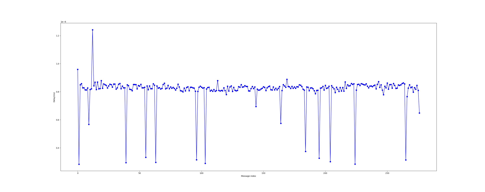
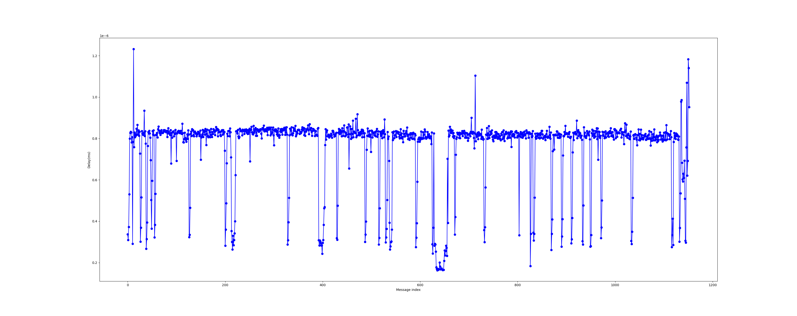
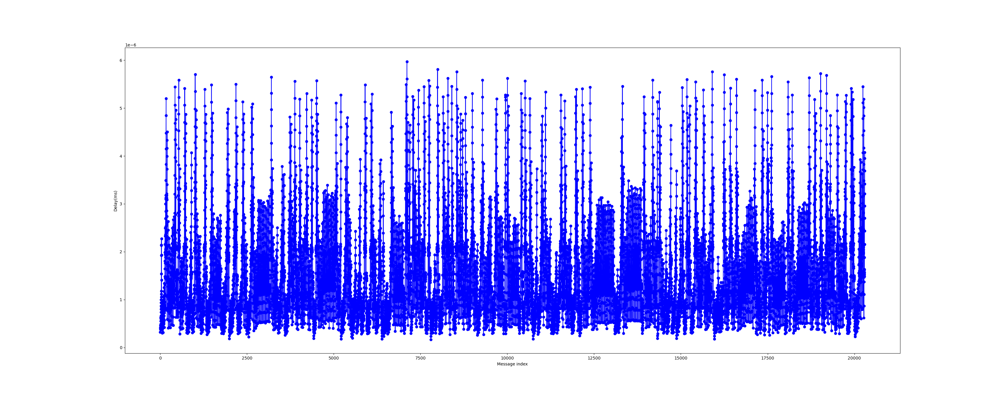

# ROS Delays
**TLDR: There is no delay.**

Tested with a single Float64 being published, delivering the time of publishing.

Horizontal axis is the message index while the vertical axis is the delay in ms.

All delays are negligable for simple Float64s. 
For larger message types, like images, this is likely different.

All tests done on Ubuntu 22.04 running natively.

Script used: [ros subscriber and publisher](../scripts/subpub_timer.py)

## ROS->ROS

Pub=10hz, Sub queue_size=10| Pub=50hz, Sub queue_size=10
:----------------------------------:|:---------------------------------------:
|

- Vetical Scale: 1e-6 for both

## ROS->ROS

Pub=50hz, 50 Pubs Sub queue_size=10| Pub=50hz, 50 Pubs, Sub queue_size=1000
:----------------------------------:|:---------------------------------------:
|

- Vertical scale: 1e-6, 1e-5

## SIM->ROS
Pub=50hz, Sub queue_size=1000, empty scene| Pub=50hz, Sub queue_size=1000, complex scene
:----------------------------------:|:---------------------------------------:
|

- Vertical scale: 1e-5 for both